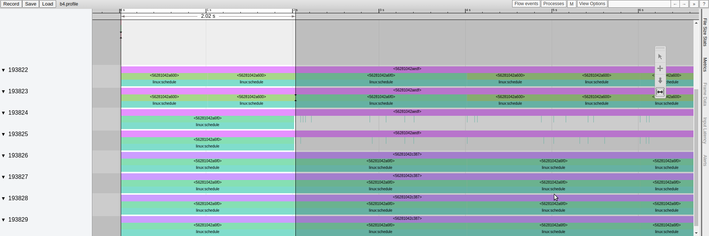

# Architecture & Design

**mumu** uses KVM in the background to run virtual machines. It also makes use of posix threads and posix libraries.

## Partition VM

**mumu** calls each VM as *Partition VM*. From now on partition vms will be referred to as partition. When a partition starts, it have a 6MB of space. In this area, page tables are given to the user as a 1:1 map. In this way, injection can be made easily through physical and virtual addresses during the first boot phase.

```t
+--------------------+ 0x0000000 User Start
|++++++++++++++++++++|
|++++++++++++++++++++|
|++++++++++++++++++++|
|++++++++++++++++++++|
|++++++++++++++++++++|
+--------------------+ 0x1000000 Page Table Entries
|                    |
+--------------------+
|                    |
+--------------------+
|                    |
+--------------------+ 0x1400000 Channel Informations
|                    |
|   ^     ^     ^    |
|   |     |     |    |
|   |     |     |    | 0x600000 Stack
+---+-----+-----+----+

   SINGLE PARTITION
```

Partitions should be defined under the `<Partitions>` node in XML file. Each partition should similar to this:

```xml
<Partition>
    <PartitionDefinition Identifier="1" Name="test1" BinaryPath="hello.bin" ScheduleChangeAction="IDLE" SetModuleSchedule="false" SystemPartition="true"/>
    <PartitionPeriodicity Duration="20000000" Period="3000"/>
    <CoreAffinity>
        <CoreMapping LogicalCoreId="0" PhysicalCoreId="3"/>
        <CoreMapping LogicalCoreId="1" PhysicalCoreId="2"/>
    </CoreAffinity>
</Partition>
```

## Multicore

mumu can run different vcpu's in different cores thanks to posix threads. In XML file programmers should explicitly define affinity of the cores.

```t
+-------+---------------+
|Core 1 |  VM-1 VCPU1   |
+-------+---------------+
|Core 2 |  VM-1 VCPU2   |
+-------+---------------+
|Core 3 |  VM-2 VCPU1   |
+-------+---------------+
```

In XML file programmer should define as follow:

```xml
<CoreAffinity>
    <CoreMapping LogicalCoreId="0" PhysicalCoreId="3"/>
    <CoreMapping LogicalCoreId="1" PhysicalCoreId="2"/>
</CoreAffinity>
```


## Static Scheduling

Static scheduling is a mechanism that allows to regulate the order in which threads execute in the code. When we look at the mumu level, we see that these are vms.

```t
         0ms         50ms                120ms     150ms
         +------------+-------------------+-----------+
Core 1   | VM1 VCPU1  |    VM3 VCPU1      | VM2 VCPU3 |
         +------------+-------------------+-----------+
Core 2   | VM1 VCPU2  |    VM2 VCPU2      | VM1 VCPU2 |
         +------------+-------------------+-----------+
Core 3   | VM2 VCPU2  |    VM1 VCPU1      | VM2 VCPU2 |
         +------------+-------------------+-----------+
Core 4   | VM3 VCPU1  |    VM2 VCPU1      | VM1 VCPU1 |
         +------------+-------------------+-----------+
```

We can measure scheduling times with `uftrace` thanks to the mumu runs on C++. The static schedule structure can be seen on uftrace as follows.


Scheduling times can be configured through XML file.

```xml
<Schedules MajorFrameDuration="60000000" ScheduleIdentifier="1" InitialModuleSchedule="true">
    <PartitionTimeWindow PartitionNameRef="test1" Duration="2000" Offset="0" />
    <PartitionTimeWindow PartitionNameRef="test2" Duration="2000" Offset="20000000" />
    <PartitionTimeWindow PartitionNameRef="test1" Duration="2000" Offset="40000000" />
    <PartitionTimeWindow PartitionNameRef="test1" Duration="2000" Offset="60000000" />
</Schedules>
```


## Shared Memory

Qemu uses the ivshmem infrastructure for shared memory. Actually, ivhsmem is installed in Linux devices as a PCI device. Then, communication can take place by `read` and `write` syscalls to these PCI devices. Ivhsmem has a lot of features (like interrupts etc) but there is a limitation that we can only use one instance of them. 

```
       +--------------------------+
       |                          |
+------+---+   +---------+        |
|          |   |         |        |
|   Qemu   |   |   Qemu  +------+ |
|          |   |         |      | |
+----+-----+   +-----+---+      | |
     |               |          | |
+----+---------------+---+   +--+-+--+
|          KVM           |   | Memory|
+------------------------+   +-------+
```

In **mumu** we designed a simple principle; each startup we inject a shared memory map into memory region (currently 0x14000). The operating system knows in which area the shared memories are here. Then, it can read and write to these addresses. At the same time, we can grant write and read permissions to these regions in the XML file. Thanks to this, while a vm partition is writing, other vm partitions can only listen. This feature is used for the sampling port.

````
+---------------+
|+++++++++++++++| Shared Memory 1 0x600000
+---------------+ <------+
|               |        |
|               |        |
|               |        +---------------------+
|               |                              |
|               |                              |
|               |                              |
+---------------+                              |
|0x140000       |                              |
|Shared Infos   +---+                          |
+---------------+   |   +--------+---------+   |
|               |   |   |  mem1  |0x6000000+---+
|               |   |   +--------+---------+
|               |   |   |  mem2  |0x8000000|
|               |   +-->+--------+---------+
+---------------+       
````